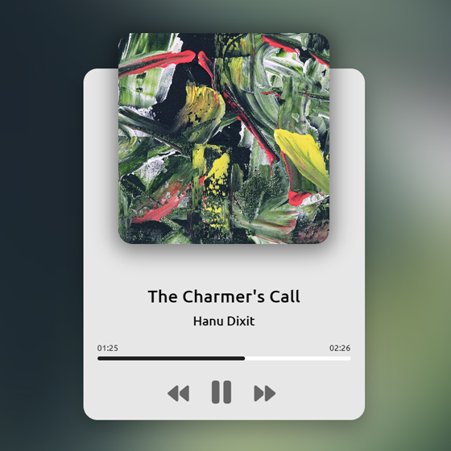

# Music Player Web Application

This is a simple music player web application that allows users to play, pause, and navigate through a list of songs. The application is built using HTML, CSS, and JavaScript.

## Project Structure

```bash
.gitignore
index.html
README.md
screenshot.jpg
script.js
style.css
assets/
    1.jpg
    1.mp3
    2.jpg
    2.mp3
    3.jpg
    3.mp3
    4.mp3
    4.png
    5.mp3
    5.png
    6.mp3
```

## Files

- **index.html**: The main HTML file that contains the structure of the web application.
- **style.css**: The CSS file that contains the styles for the web application.
- **script.js**: The JavaScript file that contains the logic for the music player.
- **assets/**: A directory that contains the music files and cover images used in the application.
- **screenshot.jpg**: A screenshot of the application.
- **.gitignore**: A file specifying which files and directories to ignore in version control.
- **README.md**: This file, which provides an overview of the project.

## Features

- Play and pause music
- Navigate to the next or previous song
- Display the current song's title, artist, and cover image
- Show the progress of the current song
- Responsive design for different screen sizes

## Usage

1. Clone the repository to your local machine.
2. Open `index.html` in your web browser.
3. Use the play, pause, next, and previous buttons to control the music player.

## Screenshot



## License

This project is licensed under the MIT License.
